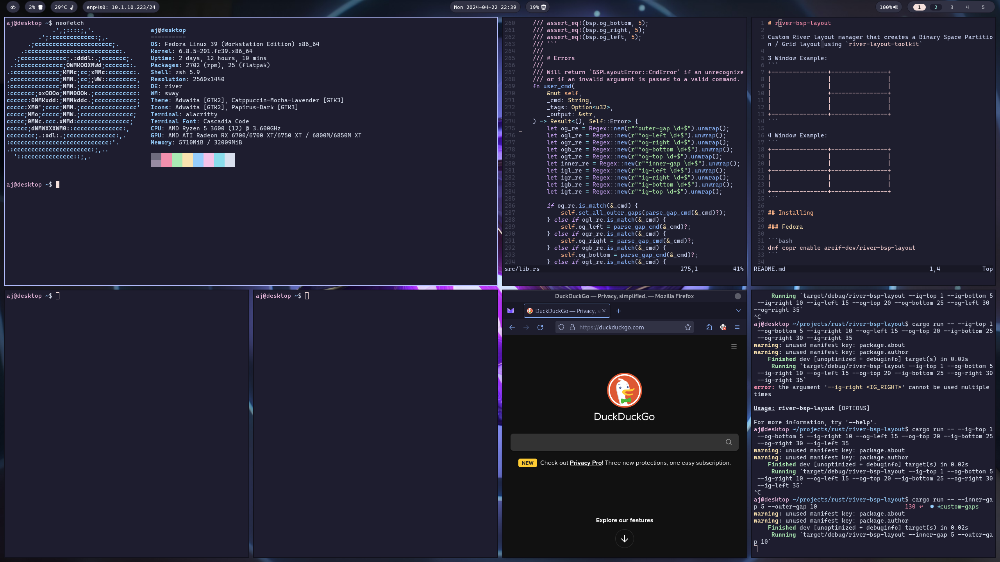

# Fedora River Atomic 

An opinionated image based on Fedora CoreOS featuring the River Wayland compositor.



## Features 

* River: Wayland compositor 
* Waybar: Status bar 
* Rofi-Wayland: Dmenu compatible launcher 
* Thunar: File manager 
* Firefox: Browser
* Distrobox: Container management
* Podman: Container management 
* Cockpit: Web administration

## Rebasing 

```bash
rpm-ostree rebase ostree-unverified-registry:ghcr.io/areif-dev/fedora-river-atomic/fedora-river-atomic:latest
```

# WARNING

The security of the image has not been configured to allow the this next section to work properly. It will be functional in the near future, however. 

Reboot the system, then run 

```bash
rpm-ostree rebase ostree-image-signed:docker://ghcr.io/areif-dev/fedora-river-atomic/fedora-river-atomic:latest
```
